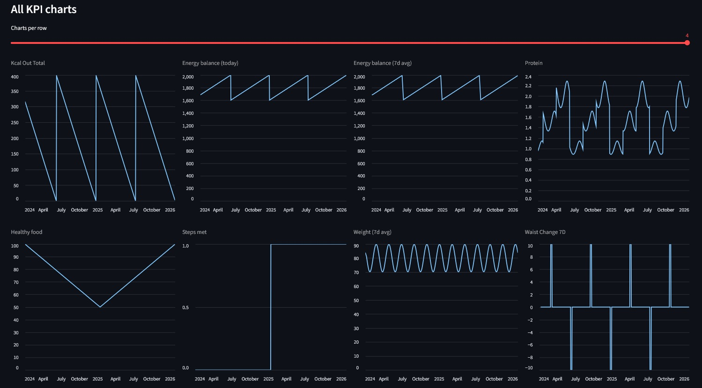

# Health Metrics Hub — Backend System

Health Metrics Hub is a portfolio-grade backend analytics system designed to demonstrate clean architecture, idempotent ingestion pipelines, rolling KPI computation, and API-first backend design.

Built with FastAPI, PostgreSQL, SQLAlchemy 2.0, and Alembic.

The system ingests daily health and fitness data via CSV, computes derived KPIs and trends, stores both inputs and outputs persistently, and exposes a clean API for analytics and visualization.




## Table of Contents

- [Live Deployment](#live-deployment)
- [Project Motivation](#project-motivation)
- [System Architecture](#system-architecture)
- [Design Decisions & Tradeoffs](#design-decisions--tradeoffs)
- [Key Features](#key-features)
- [Tech Stack](#tech-stack)
- [Architecture Overview](#architecture-overview)
- [API Endpoints](#api-endpoints)
- [Testing Strategy](#testing-strategy)
- [Project Structure](#project-structure)
- [Running Locally](#running-locally)


## Live Deployment

Streamlit (Cloud) → FastAPI (Render) → PostgreSQL (Render)

### Frontend Dashboard (Streamlit)

Deployed on Streamlit Community Cloud

**Live App:** 
https://health-metrics-app-225nupjakux8gwyzw6uvgt.streamlit.app/

The Streamlit dashboard consumes the production FastAPI backend and visualizes computed health KPIs derived from ingested CSV data.

### Backend API

Deployed on Render

**Base URL:** https://health-metrics-hub.onrender.com/

**Swagger Documentation:** https://health-metrics-hub.onrender.com/docs

The backend exposes two REST endpoints:

- POST `/api/upload-csv`  
  Uploads a CSV file, parses and validates the data, computes KPIs, and persists both raw inputs and computed outputs into PostgreSQL.

- GET `/api/kpis/`  
  Retrieves persisted KPI data with optional date-range filtering.


## Project Motivation

Health Metrics Hub was built to simulate a real-world backend analytics system rather than a simple CRUD application.

It mirrors production systems such as fitness tracking platforms, SaaS KPI dashboards, and telemetry backends.

The goal of the project is to demonstrate:

- Clean separation of business logic from infrastructure
- Rolling window KPI computations
- Idempotent ingestion workflows
- API-first backend design
- Testable, framework-independent domain logic

## System Architecture

```
                        ┌──────────────────────┐
                        │     Streamlit UI     │
                        │   (Read-only client) │
                        └────────────▲─────────┘
                                     │ HTTP
                        ┌────────────┴─────────┐
                        │       FastAPI        │
                        │   (API layer)        │
                        └────────────▲─────────┘
                                     │
                        ┌────────────┴─────────┐
                        │      Use Cases       │
                        │  (Application logic) │
                        └────────────▲─────────┘
                                     │
                        ┌────────────┴─────────┐
                        │       Domain         │
                        │  Entities + Rules    │
                        └────────────▲─────────┘
                                     │
                        ┌────────────┴─────────┐
                        │   Infrastructure     │
                        │ PostgreSQL + ORM     │
                        │ CSV Parser           │
                        └──────────────────────┘


```

**Data flow:**
```
CSV → Parser → Ingestion Use Case → Repository → PostgreSQL
                                             ↓
                                     KPI Computation
                                             ↓
                                         FastAPI
                                             ↓
                                        Streamlit
```

## Design Decisions & Tradeoffs

This section outlines the main architectural decisions and why they were made.

### 1. Clean Architecture instead of a simple CRUD structure

Rather than placing business logic inside FastAPI routes or SQLAlchemy models, the project isolates:

- Domain (pure entities and rules)
- Use cases (application workflows)
- Infrastructure (DB, parser, storage)
- Delivery layer (FastAPI, Streamlit)

**Why?**
- Business logic becomes testable without framework dependencies
- Repositories can be swapped (e.g., PostgreSQL → another DB)
- The API layer remains thin and declarative

Tradeoff: Slightly more boilerplate and indirection.

---

### 2. Idempotent CSV Ingestion

Re-uploading the same CSV overwrites records for matching dates.

**Why?**
- Real-world ingestion pipelines must handle replays and corrections
- Prevents duplicate records
- Simplifies data maintenance

Tradeoff: Slightly more complex repository logic (upsert instead of insert).

---

### 3. Rolling KPI Computation in Application Layer

Rolling averages and trends are computed in Python rather than SQL.

**Why?**
- Keeps business rules independent of a specific database
- Makes KPI logic fully unit-testable
- Easier to evolve formulas

Tradeoff: Slightly less efficient for very large datasets.

---

### 4. PostgreSQL + SQLAlchemy ORM

SQLAlchemy 2.0 ORM was chosen over raw SQL or Core.

**Why?**
- Clear mapping between domain entities and persistence layer
- Better maintainability
- Aligns with common backend production stacks

Tradeoff: Slight abstraction overhead compared to raw SQL.

---

### 5. Streamlit as Read-Only Client

The dashboard consumes the API instead of querying the database directly.

**Why?**
- Demonstrates API-first design
- Enforces separation between backend and client
- Mimics real-world frontend/backend architecture

Tradeoff: Slight additional HTTP overhead locally.


## Key Features
- CSV ingestion of daily health and fitness metrics
- Idempotent upsert of daily records (re-uploads overwrite existing days)
- ETL pipeline with validation and normalization
- KPI computation:
    - energy balance and rolling 7-day averages
    - steps adherence
    - weight and waist trends
- Handling of missing days and incomplete data
- Persistent storage using PostgreSQL
- Read-only Streamlit dashboard consuming the public API
- Fully tested domain logic, use cases, and API endpoints

## Tech Stack

- Backend API: FastAPI
- Database: PostgreSQL
- ORM: SQLAlchemy 2.0
- Schema migrations: Alembic
- Data ingestion: CSV parsing with Python standard library
- Dashboard: Streamlit (read-only, API consumer)
- Local infrastructure: Docker & Docker Compose (PostgreSQL)
- Testing: pytest (unit, use-case, and API tests)
- Configuration: environment variables via python-dotenv

## Architecture Overview

The project follows Clean Architecture, keeping business logic independent from frameworks, databases, and delivery mechanisms.

FastAPI routes are thin controllers delegating to application use cases via dependency injection.

**Domain**

Core entities representing daily metrics and computed KPIs

Interfaces defining repository and storage contracts

**Use Cases**

Application workflows such as CSV ingestion and KPI retrieval

All business rules and KPI computations live here

Fully testable without FastAPI or PostgreSQL

**Infrastructure**

PostgreSQL repositories implemented with SQLAlchemy

CSV parser and file storage implementations

Alembic migrations for schema evolution

**API**

FastAPI routers and controllers

Pydantic DTOs for input/output

Dependency injection to wire use cases and repositories

**Visualization**

Streamlit dashboard consuming the API

Read-only client with no business logic

## API Endpoints

### Upload daily metrics (CSV)
```
POST /api/upload-csv
```

Accepts a CSV file containing daily health and fitness metrics

Re-uploading a CSV overwrites existing records for the same dates (idempotent upsert)

Returns an ingestion report with processing details

### Retrieve computed KPIs
```
GET /api/kpis?start_date=YYYY-MM-DD&end_date=YYYY-MM-DD
```

Returns computed KPIs for the specified date range

Includes rolling averages and trend metrics

Missing days are handled internally by the computation logic

### Example API Response

```json
[
  {
    "date": "2026-01-01",
    "weight_7d_avg": 82.14,
    "balance_kcal": -320,
    "balance_7d_average": -250,
    "protein_per_kg": 1.85,
    "healthy_food_pct": 87.5,
    "adherence_steps": 1
  },
  {
    "date": "2026-01-02",
    "weight_7d_avg": 82.05,
    "balance_kcal": -150,
    "balance_7d_average": -240,
    "protein_per_kg": 1.92,
    "healthy_food_pct": 90.0,
    "adherence_steps": 0
  }
]
```

## Testing Strategy

The project is designed for testability via Clean Architecture:

Unit tests validate KPI computations (rolling averages, adherence logic, trend metrics).

Use case tests run with fake/in-memory repository implementations to test workflows without FastAPI or PostgreSQL.

API tests use FastAPI TestClient to validate request/response behavior end-to-end.

This ensures business logic is fully testable in isolation, while still covering integration at the API layer.


## Project Structure
```
health-metrics-hub/
├── .env.example
├── .gitignore
├── alembic.ini
├── LICENSE.txt
├── README.md
├── requirements.txt
│
├── alembic/
│   ├── env.py
│   ├── script.py.mako
│   └── versions/
│       └── a5f3bf693c80_initial_schema.py
│
├── app/
│   ├── api/
│   │   ├── main.py
│   │   ├── schemas.py
│   │   └── routers/
│   │       ├── kpis.py
│   │       └── upload.py
│   │
│   ├── business/
│   │   ├── kpi_calculator.py
│   │   └── use_cases.py
│   │
│   ├── config/
│   │   └── user_profile.json
│   │
│   ├── dashboard/
│   │   └── streamlit_app.py
│   │
│   ├── domain/
│   │   ├── entities.py
│   │   └── interfaces.py
│   │
│   └── infrastructure/
│       ├── db/
│       │   ├── base.py
│       │   ├── engine.py
│       │   ├── models.py
│       │   ├── repository_impl.py
│       │   └── local_postgres_up/
│       │       ├── .env.example
│       │       └── docker-compose.yml
│       │
│       ├── parser/
│       │   └── parser_impls.py
│       │
│       └── storage/
│           └── storage_impl.py
│
├── samples/
│   └── sample_data.csv
│
├── docs/
│   └── dashboard_kpis.jpg
│
└── tests/
    ├── unit/
    │   └── test_kpi_calculator.py
    │
    └── use_cases/
        ├── test_fastapi.py
        ├── test_get_kpis.py
        └── test_ingest_daily_csv.py

```

## Running Locally

### Prerequisites

Python 3.11+

Docker & Docker Compose

### 0. Clone the repository
```
git clone https://github.com/albermar/health-metrics-hub.git
cd health-metrics-hub
```

### 1. Create and activate a virtual environment

From the repository root:

```
python -m venv .venv
source .venv/bin/activate   # macOS / Linux
.venv\Scripts\activate      # Windows
```

### 2. Install dependencies
```
pip install -r requirements.txt
```

### 3. Configure PostgreSQL (Docker)

PostgreSQL runs locally using Docker Compose.
```
cd app/infrastructure/db/local_postgres_up
cp .env.example .env
```

This .env file is used by Docker Compose to initialize the PostgreSQL container.

Env vars example for docker compose:

```
POSTGRES_USER=postgres
POSTGRES_PASSWORD=postgres
POSTGRES_DB=health_metrics
```


### 4. Start PostgreSQL
```
cd app/infrastructure/db/local_postgres_up
docker compose up -d
```


PostgreSQL will be available at localhost:5433.

### 5. Configure application environment

From the repository root:
```
cp .env.example .env
```

This file is used by FastAPI, Alembic, and Streamlit.

Env vars example:
```
POSTGRES_USER=postgres
POSTGRES_PASSWORD=postgres
POSTGRES_DB=health_metrics
POSTGRES_HOST=localhost
POSTGRES_PORT=5433
```

### 6. Run database migrations
```
alembic upgrade head
```

### 7. Start the API
```
uvicorn app.api.main:app --reload
```

The API will be available at http://localhost:8000

Swagger UI is available at http://localhost:8000/docs

### 8. Upload a sample CSV

A sample CSV file is provided in sample_data/.

From the repository root:

```curl
curl.exe -X POST http://localhost:8000/api/upload-csv -F "file=@samples/sample_data.csv"
```

This uploads the file from your local machine to the API for processing.

### 9. Start the dashboard
```
streamlit run app/dashboard/streamlit_app.py
```

The dashboard consumes the API and displays computed KPIs.
