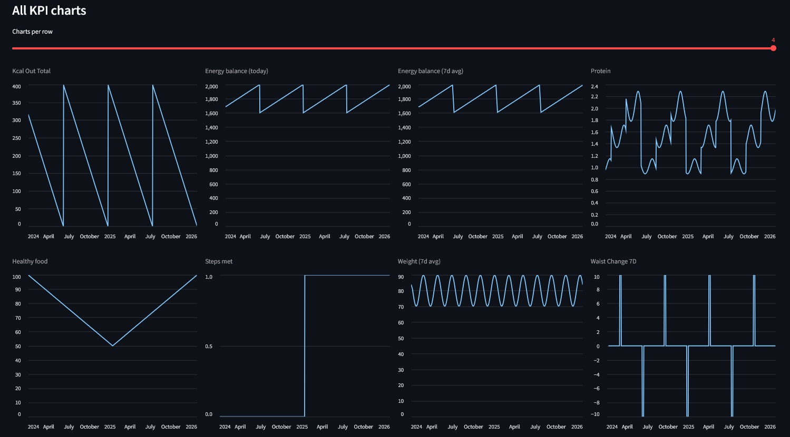

# Health Metrics Hub API

## Overview

Production-grade **backend analytics system** built with **FastAPI**, **PostgreSQL**, **SQLAlchemy 2.0**, and **Alembic**.

The system ingests daily health and fitness data via CSV, transforms it into validated domain models, and applies a KPI computation pipeline including **rolling averages, energy balance, adherence metrics, and trend analysis**.

It provides a complete end-to-end workflow:

- CSV ingestion with validation and idempotent upsert
- persistent storage of raw data and computed KPIs
- time-series analytics and rolling metrics
- API access for data retrieval and visualization

A **Streamlit dashboard** consumes the public API and allows users to explore KPIs and trends interactively.

Live Demo: https://app-health.alberto.network  
Live API: https://api-health.alberto.network  
API Docs: https://api-health.alberto.network/docs

## Index

- [Overview](#overview)
- [Core Features](#core-features)
- [Architecture](#architecture)
- [Pipelines](#pipelines)
- [API Endpoints](#api-endpoints)
- [Tech Stack](#tech-stack)
- [Quickstart](#quickstart)
- [License](#license)

## Core Features

- **CSV ingestion pipeline**  
  Upload daily health and fitness data with validation and structured parsing.

- **Idempotent data ingestion**  
  Re-uploading the same CSV safely overwrites existing records, preventing duplicates and ensuring data consistency.

- **KPI computation engine**  
  Automatic calculation of key metrics such as energy balance, rolling averages, adherence scores, and trend indicators.

- **Time-series analytics**  
  Built-in support for rolling windows, trend analysis, and handling of missing or irregular data.

- **Persistent storage**  
  All raw inputs and computed KPIs are stored in PostgreSQL for reliable querying and historical analysis.

- **API-first design**  
  Clean REST API for ingestion and retrieval, enabling integration with external clients and dashboards.

- **Clean architecture implementation**  
  Clear separation between domain, use cases, infrastructure, and API layers for maintainability and testability.

- **Interactive dashboard**  
  Streamlit application that consumes the API and allows real-time exploration of KPIs and trends.

## Architecture

The system follows a Clean Architecture approach where business logic is isolated from infrastructure concerns.

                ┌───────────────┐
                │   Client / UI │
                │ (Streamlit /  │
                │  Swagger UI)  │
                └───────┬───────┘
                        │
                        ▼
                ┌───────────────┐
                │     FastAPI   │
                │     Routers   │
                └───────┬───────┘
                        │
                        ▼
                ┌───────────────┐
                │  Application  │
                │   Use Cases   │
                └───────┬───────┘
                        │
                        ▼
                ┌───────────────┐
                │     Domain    │
                │ Entities +    │
                │  Interfaces   │
                └───────┬───────┘
                        │
                        ▼
                ┌───────────────┐
                │ Infrastructure│
                │               │
                │ PostgreSQL    │
                │ SQLAlchemy    │
                │ CSV Parser    │
                └───────────────┘

The application layer orchestrates ingestion and KPI computation workflows, while the domain layer contains business rules independent from frameworks or storage.

This structure keeps the system modular, testable, and easy to extend.

## Pipelines

### CSV Ingestion Pipeline

CSV → Parser → Validation → Use Case → Repository → PostgreSQL

- Parses raw CSV input into structured data  
- Validates required fields and data consistency  
- Applies idempotent upsert logic (no duplicates)  
- Persists cleaned data into the database  

---

### KPI Computation Pipeline

Stored Data → KPI Engine → Rolling Windows → Trend Metrics → API Response

- Computes derived metrics such as energy balance and adherence  
- Applies rolling averages (e.g. 7-day windows)  
- Handles missing or irregular data points  
- Returns processed time-series ready for visualization  

---

### API Consumption Flow

FastAPI → JSON Response → Streamlit Dashboard

- API exposes ingestion and analytics endpoints  
- Streamlit consumes the API as a read-only client  
- Enables interactive exploration of KPIs and trends  

## API Endpoints

### Upload CSV

`POST /api/upload-csv`

Upload a CSV file containing daily health and fitness metrics.

- Validates and parses input data  
- Applies idempotent upsert (safe re-uploads)  
- Returns an ingestion report  

---

### Get KPIs

`GET /api/kpis?start_date=YYYY-MM-DD&end_date=YYYY-MM-DD`

Retrieve computed KPIs for a given date range.

- Includes rolling averages and trend metrics  
- Handles missing or irregular data internally  
- Returns time-series data ready for visualization  

## Tech Stack

- **Backend:** FastAPI  
- **Database:** PostgreSQL  
- **ORM:** SQLAlchemy 2.0  
- **Migrations:** Alembic  
- **Data Processing:** Python (CSV parsing, KPI computation)  
- **Dashboard:** Streamlit (API consumer)  
- **Testing:** pytest  
- **Configuration:** python-dotenv  

## Quickstart

### 1. Clone the repository

git clone https://github.com/albermar/health-metrics-hub.git  
cd health-metrics-hub

---

### 2. Setup environment

python -m venv .venv  
source .venv/bin/activate   # macOS / Linux  
.venv\Scripts\activate      # Windows  

pip install -r requirements.txt

---

### 3. Configure environment variables

Copy the example file:

cp .env.example .env

Fill with:

POSTGRES_USER=  
POSTGRES_PASSWORD=  
POSTGRES_DB=  
POSTGRES_HOST=  
POSTGRES_PORT=  
API_BASE_URL=  

- `API_BASE_URL` is used by the Streamlit app  
- If left empty, it defaults to `http://localhost:8000`

---

### 4. Start PostgreSQL (Docker)

cd app/infrastructure/db/local_postgres_up  
cp .env.example .env  
docker compose up -d

---

### 5. Run migrations

alembic upgrade head

---

### 6. Start the API

uvicorn app.api.main:app --reload  

API: http://localhost:8000  
Docs: http://localhost:8000/docs  

---

### 8. Start the dashboard

streamlit run app/dashboard/streamlit_app_2.py

## License

This project is licensed under the MIT License.